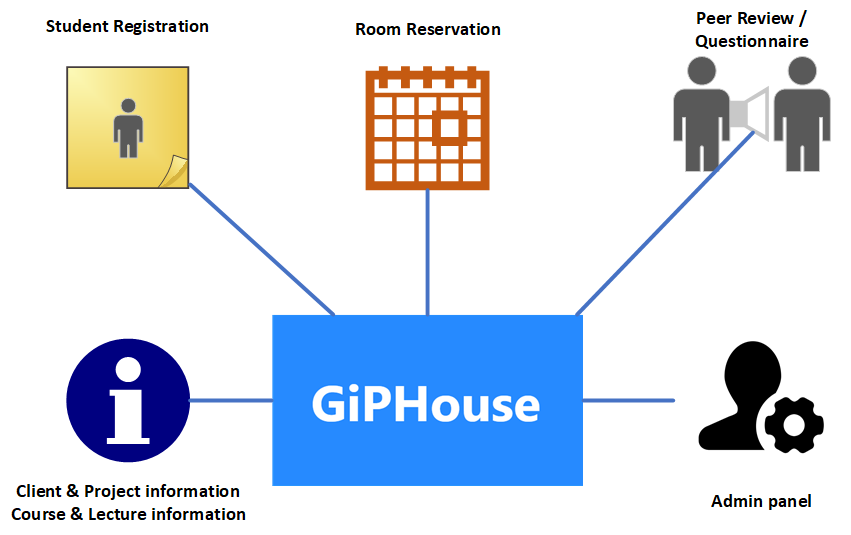
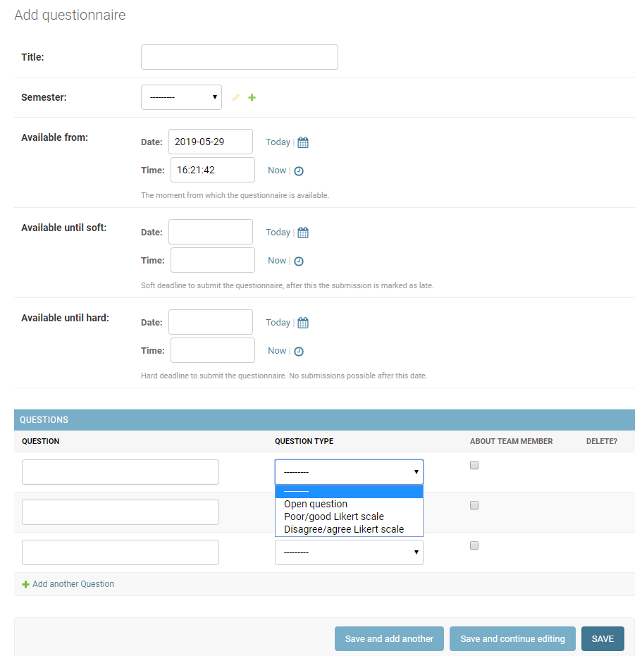
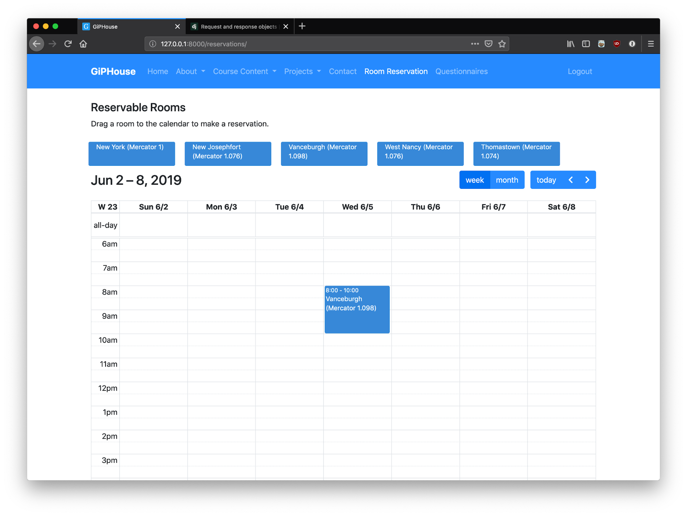

# Project - GiPHouse
_Services & Features_

## 1. Intro

This documents gives an overview of all the features in the new
GiPHouse website that was developed during the spring of 2019. At the
end of this document a couple of extra features are described that would
be a nice addition to the system and could be implemented during the
next GiPHouse internal project. Read chapter 2.2 for the flow that
should be followed at the beginning of a new semester

## 2. Current Features

### 2.1 Website content and overview

The website displays the following information that is accessible to
all visitors, other systems will be further discussed below.

-   Homepage with current project and clients
-   Description of GiPHouse and the way of working
-   Course content per semester
-   Past projects and description
-   Contact page
-   Room reservations
-   Peer-review & questionnaires

In the admin panel the admin and the directors are able to add, edit
and remove projects, clients, courses, semesters, lectures, rooms and
questionnaires.

The informative text on the website itself can be changed via GitHub,
when you have some technical knowledge.

### 2.2 A new semester - opening registrations

Every new semester an admin has to create the 'new semester' in the
admin panel, "Home › Courses › Semesters". After creating the semester
the administrator should add project and clients, otherwise students
wouldn't be able to select a project preference.

When this is complete students are able to register for the course and
fill in their project preference. The process for a new semester will
involve the following steps:

1.  Create semester
2.  Create clients
3.  Create projects and link to clients
4.  Select semester and open registration
5.  Mail students to register on the GiPHouse website
    giphouse.nl/register
6.  Press the button to automatically assign students to projects
7.  Change students assigned to project to own insights

## 2.3 Login Roles

Students are able to login on the website using the login button.
People wishing to access the admin panel should append "/admin" to the
URL.

The admin panels contains different user roles on witch different
permissions can be attached.The system contains the following
roles:

-   Admin
-   Director
-   SDM student (automatically assigned to students registering for SDM
    course)
-   SE student (automatically assigned to students registering for SE
    course)
-   SuperUser

On the admin page "Home › Authentication and Authorization › Users" you
are able to assign these roles to a specific user. This is also where
the SuperUser role can be assigned.

On the admin page "Home › Registrations › Roles" you are able to
change the permissions that belong to a role.

## 2.4 Peer-review Questionnaire

You can create and edit a questionnaire in the 'home › questionnaires
› questionnaires' admin page. You can give a title to the
questionnaire, for example: 'peer-review 2019'. The questionnaire has to
contain dates for: available from, available until soft, and available
until hard. Available until soft means that there is a soft deadline,
but the questionnaire is not closed yet. The questionnaire will be
closed on the hard deadline. 

Below the information about the questionnaire, you can add and edit
questions for that specific questionnaire. These questions can be of 3
types, namely: open question, poor/good likert scale and disagree/agree
likert scale. You can also make the questions about team members. 

The directors and admin can also edit or remove the questionnaires by
opening a questionnaire via 'home › questionnaires › questionnaires'
and selecting the questionnaire you want to edit. 

When you want students to fill in the questionnaire, you have to email
them about this. The questionnaire will be visible for the students on
the GiPHouse webpage. Once the student has submitted the questionnaire,
it can no longer be adjusted. 

The directors can see who filled in the questionnaire and the results.
Average values per question per person, per question per group, total
etc. are displayed. In addition, it is also possible to filter the
results by person and group.

## 2.5 Room reservation

GiPHouse employees have at the time of writing access to two different
rooms in the Mercator 1 building. To avoid people showing up to an
occupied room a room reservation system has been put into place. The new
room reservation system is integrated into the GiPHouse website and is
usable when logged-in.

The admin and directors can add, edit and remove rooms from the system.
The students can reserve a room by dragging a location block into the
timetable. These reservations can also be edited and removed.

## 3. Proposed Features

These features have been discussed during the project but weren't
implemented because of time limitations.

-   It would be nice if admins and directors were able to add notes to
    the personal page of individual students. This is useful for keeping
    track of problems or positive actions and can be used during the
    final peer review and assessment by teacher and directors. Right-now
    directors have a separate system for storing students notes and
    integrating this in the GiPHouse system creates a more complete
    ecosystem.
-   It should be possible for a group to submit a cross-group peer
    review in the GiPHouse system. Right-now groups have to e-mail these
    reports to the directors, but integrating this in the system
    compliments to the ecosystem.
-   E-mail alias. In the new system directors and admins can download a
    .csv file containing the correct alias and all group member with
    their personal e-mailadres. This .csv file can be imported in
    GSuite. It would be nice if the GipHouse website would create an
    email alias automatically after the groups are formed. This is not
    that difficult to implement, Google offers a usable API that allows
    the creation of aliases.
-   It would be convenient if the general information pages on the
    website where editable from the admin panel.

